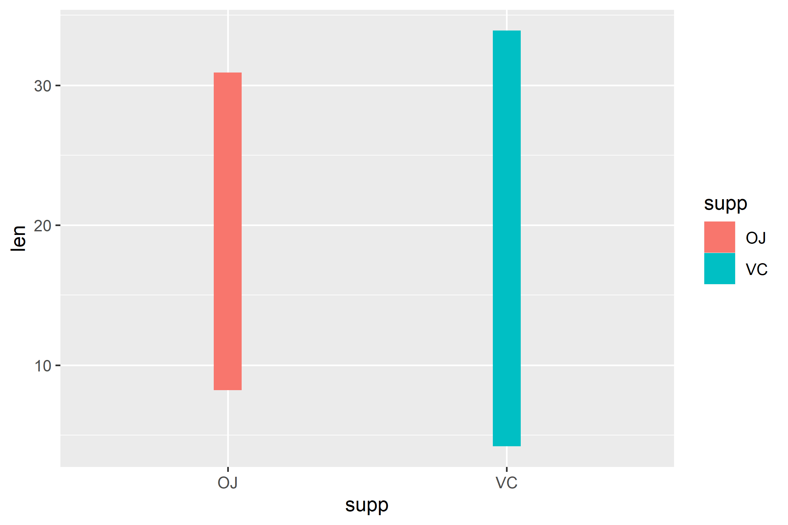
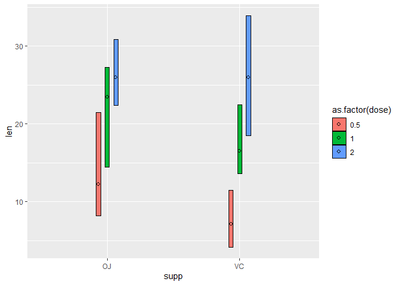

<!-- README.md is generated from README.Rmd. Please edit that file -->

# ggGantt

<!-- badges: start -->
<!-- badges: end -->

The goal of ggGantt is to make a gantt plot.

## Installation

You can install the development version of ggGantt like so:

``` r
# install.packages("devtools")
devtools::install_github("BioSenior/ggGantt")
```

## Example

This is a basic example which shows you how to plot a gantt graph using
`ggGantt`:

``` r
library(ggGantt)
#> 载入需要的程辑包：tidyverse
#> ── Attaching packages ─────────────────────────────────────── tidyverse 1.3.2 ──
#> ✔ ggplot2 3.3.5     ✔ purrr   0.3.4
#> ✔ tibble  3.1.8     ✔ dplyr   1.0.9
#> ✔ tidyr   1.1.4     ✔ stringr 1.4.0
#> ✔ readr   2.1.1     ✔ forcats 0.5.1
#> ── Conflicts ────────────────────────────────────────── tidyverse_conflicts() ──
#> ✖ dplyr::filter() masks stats::filter()
#> ✖ dplyr::lag()    masks stats::lag()

## basic example code
p <- ggplot(ToothGrowth, aes(supp, len))

# gantt plot
p + geom_gantt(aes(fill = supp), width = 0.1)
```



``` r
# Add stroke and median points
p + geom_gantt(aes(fill = as.factor(dose)),
               color = "black", stroke = 0.1, width = 0.1,
               position = position_dodge(0.2))
```


